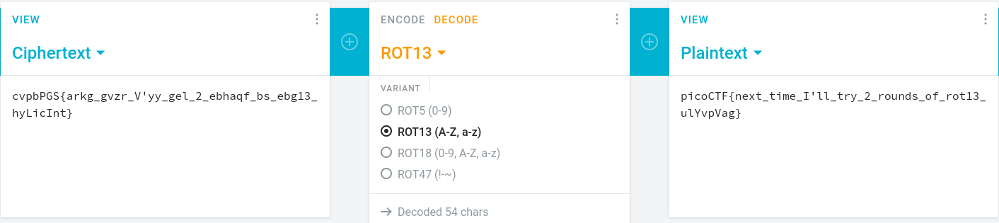

# picoCTF Lab: [Mod 26](https://play.picoctf.org/practice/challenge/144)

## Table of Contents

1. Understanding The Challenge
2. Ideation
3. Execution
4. Results

## Understanding The Challenge

We get the following description:

> Cryptography can be easy, do you know what ROT13 is? `cvpbPGS{arkg_gvzr_V'yy_gel_2_ebhaqf_bs_ebg13_hyLicInt}`

We will keep in mind of `ROT13`. We can also see that they have provided the flag but it appears to be modified/perturbed. We have to undo that and obtain the proper flag.

## Ideation

Doing some quick research, we can find out what `ROT13` is:

> ROT13 is a simple letter substitution cipher that replaces a letter with the 13th letter after it in the latin alphabet. - *[Wikipedia](https://en.wikipedia.org/wiki/ROT13)*

So ROT is essentialy a method to cipher a given piece of text depending on the number of letters.

In many situations, we need to keep shifting the letters until we get a string of text that makes sense. But in this case, since we `ROT13` was used, a string that went through `ROT13` is essentially an inverse of the original string. Reason: There are only 26 letters in the English alphabet. Hence, the name of the challenge `Mod 26` (clever).

So,

```zsh
a --ROT13--> n --ROT13--> a
```

we should only need to run ROT13 on the string again to obtain the original.

## Execution

Any online tool will do the trick:



We succesfully deciphered the string and obtained the flag!

## Results

After deciphering the string, we get the flag: `picoCTF{next_time_I'll_try_2_rounds_of_rot13_ulYvpVag}` (ironic).   