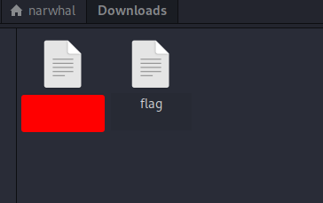

# picoCTF Lab: [Obedient Cat](https://play.picoctf.org/practice/challenge/147)

## Table of Contents

1. Understanding The Challenge
2. Ideation
3. Execution
4. Results

## Understanding The Challenge

The challenge starts of with the following description:

> This file has a flag in plain sight (aka "in-the-clear"). [Download flag](https://mercury.picoctf.net/static/0e428b2db9788d31189329bed089ce98/flag).

Using the hyperlink, we will be able to download a file called `flag`.



Additionaly, we can use the title of the lab as a clue.

## Ideation

`cat` is a usefull command line command to read out files in ASCII format. With that in mind we can try to use `cat` on the file we downloaded.

## Execution

```zsh
┌──(narwhal㉿WhoAreWe)-[~]
└─$ cd Downloads         

┌──(narwhal㉿WhoAreWe)-[~/Downloads]
└─$ cat flag        
picoCTF{s4n1ty_v3r1f13d_2fd6ed29}
```

It returned the flag we were looking for!

## Results

With that we managed to `cat` out the contents of the file in our CLI and obtained the flag: `picoCTF{s4n1ty_v3r1f13d_2fd6ed29}`.